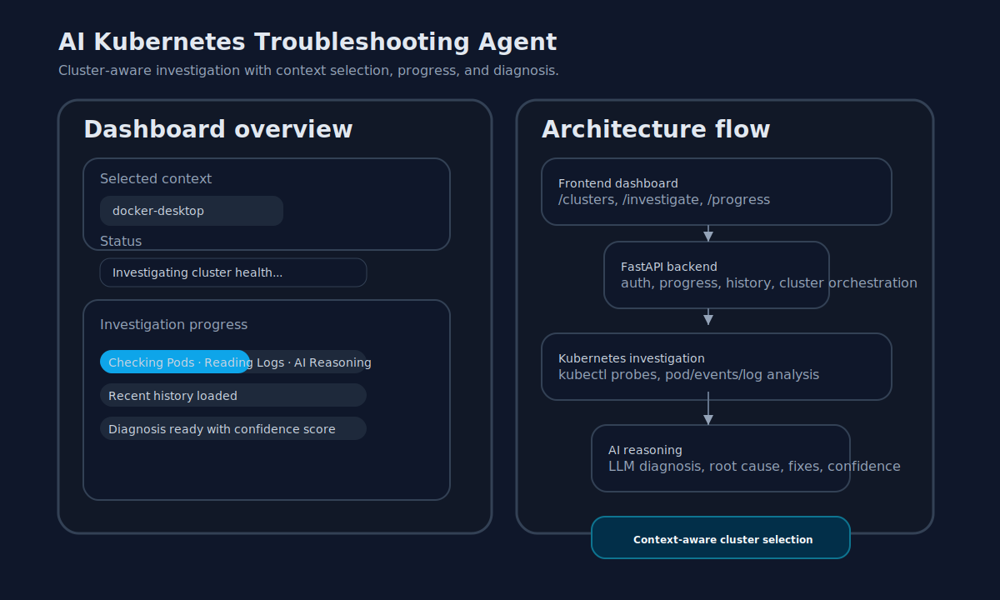
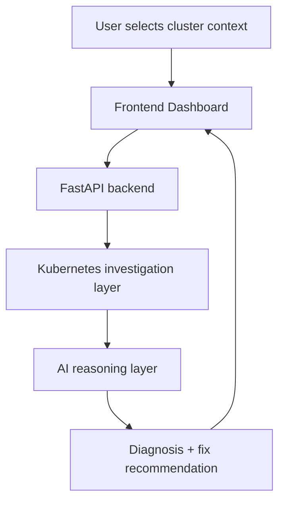

# AI Kubernetes Troubleshooting Agent


A hands-on, portfolio-ready project for Kubernetes incident investigation using AI reasoning.



## What this project does

This system helps DevOps teams run on-demand cluster investigations by:
- discovering kubeconfig contexts and selecting the target cluster
- collecting pod, deployment, event, log, and networking evidence
- synthesizing results with an AI reasoning layer
- delivering a root cause diagnosis, suggested fix, and confidence score
- storing history of past investigations for auditability

## Why it matters

Kubernetes incidents are often noisy and time-sensitive. This project is designed to reduce mean time to diagnosis by combining cluster evidence with AI-powered interpretation in a single workflow.

## Key features

- kubeconfig context discovery for local cluster selection
- read-only evidence collection from the selected cluster
- progress tracking during investigation
- AI diagnosis and remediation guidance
- investigation history and cluster-aware context tracking

## Architecture at a glance



## Current APIs

- `GET /health` — service health check
- `GET /clusters` — list kubeconfig contexts and current context
- `POST /investigate` — start a cluster investigation with optional namespace/context
- `GET /progress/{progress_id}` — poll investigation progress
- `GET /history` — view past investigations

## Quick start

1. Copy the sample environment file:
   ```powershell
   copy .env.example .env
   ```
2. Edit `.env` with your OpenRouter API key and kubeconfig path:
   ```env
   OPENROUTER_API_KEY=YOUR_API_KEY
   OPENROUTER_MODEL=gpt-4o-mini
   KUBECONFIG_PATH=C:\Users\YourUser\.kube\config
   NEXT_PUBLIC_API_BASE_URL=http://localhost:8000
   ```
3. Build and start the stack:
   ```powershell
   docker compose up --build
   ```
4. Open the app in your browser:
   - Frontend: `http://localhost:3000`
   - Backend health: `http://localhost:8000/health`

Optional: if you want the backend container to access your host kubeconfig for live cluster investigations, create a small override file and run with it.

1. Set `KUBECONFIG_PATH` in your `.env` to the path of your kubeconfig, e.g. `C:\Users\You\.kube\config`.
2. Run with the helper compose file to mount the kubeconfig into the backend container:
   ```powershell
   docker compose -f docker-compose.yml -f docker-compose.kubeconfig.yml up --build
   ```

## Usage

- Select the kubeconfig context to investigate.
- Optionally choose a namespace or leave it blank to scan all namespaces.
- Click `Investigate Cluster` to begin.
- Watch progress, then review the diagnosis and suggested fix.
- Review past investigations in the history table.

## Repository structure

- `backend/` — FastAPI backend, Kubernetes probe orchestration, AI reasoning, auth/history
- `frontend/` — Next.js dashboard with cluster selection and investigation UI
- `docs/` — architecture and API documentation
- `prompts/` — project setup and workflow prompts

## Notes for GitHub readers

This repo is focused on an AI-assisted Kubernetes troubleshooting workflow, not cluster mutation. It is ideal for demonstrating full-stack engineering across Kubernetes, Python, React, and LLM integration.
