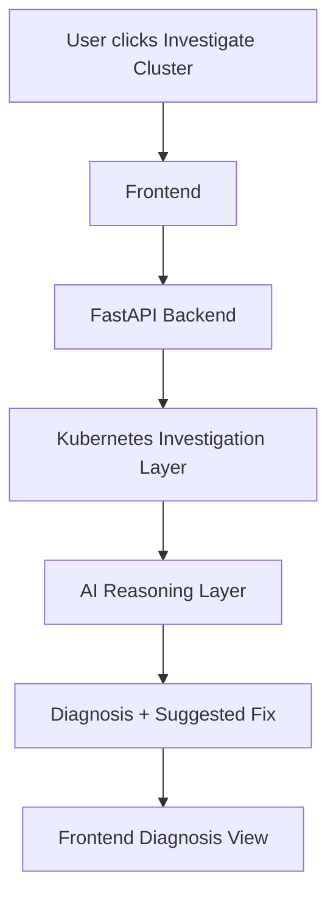

# Architecture Overview

## Overview

The AI Kubernetes Troubleshooting Agent is an on-demand diagnostic system. It is designed to inspect a Kubernetes cluster, gather evidence, and present a human-readable diagnosis with suggested fixes.

## Core components

### 1. Frontend

The frontend is the entry point for the user experience.

Responsibilities:
- start a troubleshooting run
- show investigation results
- display evidence and remediation steps
- allow users to review previous investigations

### 2. FastAPI backend

The FastAPI service acts as the orchestrator.

Responsibilities:
- receive investigation requests
- coordinate the investigation workflow
- call the Kubernetes inspection layer
- call the LLM reasoning layer
- return a structured diagnosis response

### 3. Kubernetes investigation layer

This layer performs read-only cluster inspection.

Responsibilities:
- read pod, deployment, service, ingress, and node state
- inspect events and logs
- assemble evidence into a compact investigation report

### 4. AI reasoning layer

The AI layer interprets collected evidence and produces a structured diagnosis.

Recommended model: Azure OpenAI GPT-4.1

Responsibilities:
- identify likely root causes
- explain evidence-based reasoning
- propose remediation steps
- provide confidence and follow-up checks

### 5. Optional persistence layer

A persistence layer can store investigation history.

Possible options:
- PostgreSQL for structured history
- Redis for short-lived cache or task state

## Request flow

## Design principles

- Read-only by default
- Human-in-the-loop
- Evidence-first reasoning
- Clear and explainable outputs
- RBAC-aware cluster access

## Security considerations

- Use least-privilege Kubernetes RBAC
- Never expose secrets in investigation output
- Limit log access to relevant namespaces where possible
- Store API keys in environment variables or secret managers

## What this system does not do

This design does not implement:
- a Kubernetes controller
- reconciliation loops
- automatic patching or self-healing
- cluster-wide mutation workflows
