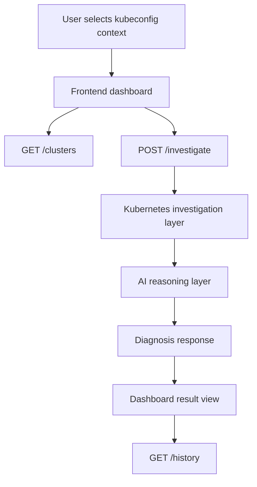

# Architecture Overview

## Overview

The AI Kubernetes Troubleshooting Agent is an on-demand diagnostic system for Kubernetes clusters. It discovers kubeconfig contexts, allows target cluster selection, gathers evidence, and presents a clear diagnosis with remediation guidance.

## Core components

### 1. Frontend

The frontend is the entry point for the user experience.

Responsibilities:
- discover kubeconfig contexts from local environment
- allow cluster context selection
- start investigations and show progress
- render diagnosis, logs, and history

### 2. FastAPI backend

The FastAPI service acts as the orchestrator.

Responsibilities:
- receive investigation requests and selected kubeconfig context
- call the Kubernetes inspection layer with the chosen context
- coordinate evidence collection and progress tracking
- call the AI reasoning layer
- return a structured diagnosis response

### 3. Kubernetes investigation layer

This layer performs read-only cluster inspection.

Responsibilities:
- inspect pods, deployments, services, endpoints, and events
- collect logs for problematic workloads
- support both namespace-scoped and all-namespace investigations
- report kubectl errors and hints

### 4. AI reasoning layer

The AI layer interprets collected evidence and produces a structured diagnosis.

Responsibilities:
- identify likely root causes from evidence
- explain findings in human-readable terms
- suggest remediation commands and next steps
- score confidence for the diagnosis

### 5. History and audit layer

A lightweight history service stores investigation records in memory.

Responsibilities:
- keep recent investigations visible in the dashboard
- preserve selected context and namespace for auditability
- support demo and early-stage troubleshooting workflows

## Request flow

## Design principles

- Read-only investigation first
- Cluster-aware context selection
- Evidence-driven diagnosis
- Explainable AI output
- Minimal user friction

## Security considerations

- Use least-privilege Kubernetes RBAC
- Keep kubeconfig path and API keys out of source control
- Do not expose secrets from cluster logs
- Use environment variables for all sensitive values

## What this system does not do

This implementation is not a Kubernetes operator or mutating controller. It does not:
- automatically update cluster state
- perform write operations in the cluster
- manage reconciliation or self-healing
- store long-term production data yet
